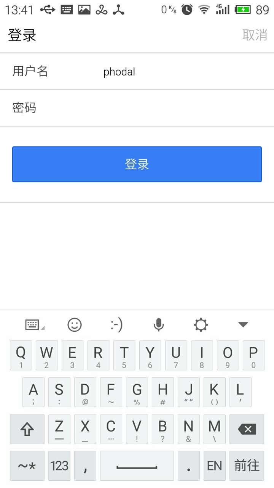
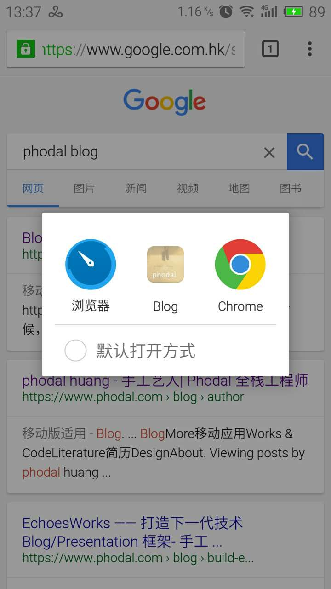

#Phodal Blog APP

> A Mobile App for [https://www.phodal.com/](https://www.phodal.com/).

##Feature

1. See All Blogposts
2. Login/Logout
3. Create Posts(Publish/Waiting for Publish)
4. Save/Load Draft

##Tech 

1. Django 
2. Django REST Framework
3. Django REST Framework JWT
4. Angular
5. Ionic
6. ngMessages
7. Markdown

##TODO

1. use full path markdown
2. Markdown Improve

##Screenshot

  

##License

© 2015 [Phodal Huang][phodal]. This code is distributed under the MIT license.
[phodal]:http://www.phodal.com/
